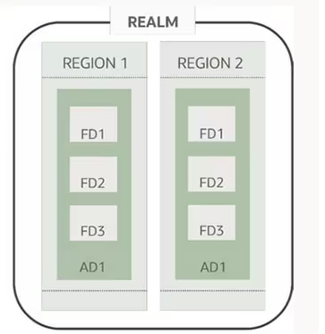

# Sovereign Controls  <!-- omit from toc -->

## Table of contents <!-- omit from toc -->
- [Summary](#summary)
- [Principle 1. Location](#principle-1-location)
  - [Policies](#policies)
  - [Quota Policies](#quota-policies)
- [Principle 2. Isolation](#principle-2-isolation)
- [Principle 3. Access Management](#principle-3-access-management)
  - [IAM](#iam)
  - [Audit Service logs](#audit-service-logs)
  - [Access Governance](#access-governance)
  - [Cloud Guard and Security Zones](#cloud-guard-and-security-zones)
  - [Vulnerability scanning](#vulnerability-scanning)
- [Principle 4. Encryption](#principle-5-encryption)

## Summary
The Sovereign Controls addons consists of two documents:
- **This** document, expands on [Oracle Cloud Infrastructure
Sovereign Cloud Principles](https://docs.oracle.com/en-us/iaas/Content/Resources/Assets/whitepapers/oracle-sovereign-cloud-principles.pdf) document, covering the Sovereign principles that can be used to meet local regulatory requirements using Landing Zone.
- The Sovereign [implementation guide](./implementation.md) covering the steps to extend the existing LZ with the Sovereign Controls addon.
In the following sections in order to simplify the example of Sovereign LZ we take an example of a German customer who wants to implement Sovereign controls, however these principles can be used by any customer to meet local regulations.

## Principle 1. Location
[OCI *realms*](https://docs.oracle.com/en-us/iaas/Content/General/Concepts/regions.htm) are physical boundary of a cloud offering acompanied by possible different operations team and possibly a part of a different Oracle legal entities depending on the offering. *Realms* consist of multiple *regions*, dedicated networking and control plane resulting in a complete isolation of different realms. Regions within a realm are be located in multiple physical locations. Each *region* has one or more *availability domains (AD)*. AD is bound to a specific data center. When customer subscribes to OCI Cloud a new [*tenancy*](https://docs.oracle.com/en/cloud/foundation/cloud_architecture/governance/tenancy.html) is created in a contractually agreed *realm*. A _tenant_ is logical boundary creating isolated evnironment for each customer. A _tenant_ is by default subscribed only to the [Home Region](https://docs.oracle.com/en-us/iaas/Content/Identity/Tasks/managingregions.htm), however with required policies *Tenancy* can subscribe to all available regions within the realm (subject to service limits). This can be controlled using Sovereign Landing Zone Addon using policies below. In our example of a German customer with mandate to keep data within EU Sovereign Cloud eu-frankfurt-2 region and can limit their tenancy data locations to this region and prevent storing data in any other region.

Oracle Cloud has a set of different cloud offerings including, but not limited to [Public Cloud](https://www.oracle.com/cloud/public-cloud-regions/), [Oracle Alloy](https://www.oracle.com/cloud/alloy/), [EU Sovereign Cloud](https://www.oracle.com/cloud/eu-sovereign-cloud/), [OCI Dedicated Region](https://www.oracle.com/cloud/cloud-at-customer/dedicated-region/). Each of these are located in their own realm.

Tenancy consits of one or more [Compartments](https://docs.oracle.com/en/cloud/foundation/cloud_architecture/governance/compartments.html). Compartments are used for logical separation of resources within a tenancy. Compartments can be nested and hold resources, and permission assignments. To control access rights [policies](https://docs.oracle.com/en-us/iaas/Content/Identity/Concepts/policygetstarted.htm) are used to bind permissions to a certain user group.

Within a realm, policies and quotas can be utilized to limit resource usage in other OCI regions. Oracle Cloud offers a diverse range of services to support various needs, including compute, storage, database, and artificial intelligence services. This principle ensures that these services are used responsibly and within established limits.

### Policies
Policies can be used to restrict permissions to a specific region by restricting access to resources in other regions. Here's an example of limit policy to eu-frankfurt-2 (for short STR) region which is the OCI EU Sovereign Cloud Germany Central region.
```
Allow group str-admins to manage all-resources in tenancy where request.region = 'str'
```
A policy limit like this can be applied to any required policy. Note IAM related permisions need to be always assigned in the Home Region. If it's required to managed multiple segregated location with different regulations it's recommended to consider Child Tenancy set-up for different boundaries.

### Quota Policies
Use Quota Policies in Oracle Cloud Infrastructure to control resource consumption/creation based on a region within compartments/Tenancy. Quota Policies limit the number of resources that can be created in a compartment/tenancy based on the region. In this example the customer wants to make sure there's no quota available in the regions other than eu-frankfurt-2 (STR for short) region.
```
zero compute-core quota /*/ in tenancy where request.region != 'eu-frankfurt-2'
zero database quota /*/ in tenancy where request.region != 'eu-frankfurt-2'
zero vcn quota /*/ in tenancy where request.region != 'eu-frankfurt-2'
zero filesystem quota /*/ in tenancy where request.region != 'eu-frankfurt-2'
zero object-storage quota /*/ in tenancy where request.region != 'eu-frankfurt-2'
```
The provided list of Quota Policies is not exhausitve and includes only the most common services used for storing data. See [Available Quota by Service](https://docs.oracle.com/en-us/iaas/Content/Quotas/Concepts/resourcequotas_topic-Available_Quotas_by_Service.htm) for a full list.

Additionally for multi tenancy set-up the [Governance Rules](https://docs.oracle.com/en-us/iaas/Content/General/Concepts/organization_management_overview.htm#governance_rules) in Organizations service can be used to impose restriction on child tenancy



## Principle 2. Isolation
Oracle Cloud offering is at a high level segregated to the Control Plane and the Data Plane. The Control Plane is managed by Oracle and is used for managing and orchestrating underlaying infrastructure using Console or APIs. The Control Planes ensure logical separation between different customers. The Data Plane is a result of the user configuration of the services in the Control Plane and defines virtual resrouces like Networking, Database, Compute instances.

An organization should have the assurance that their data remains in the physical and logical environments that they have selected.

We can identify different levels of **isolation**: physical isolation, logical isolation, and network isolation.

* **Physical isolation** can be achieved using the various dedicated cloud deployment options such as Dedicated Regions (DRCC), Isolated Regions (for mission-critical or classified workloads), and Alloy (for partners building their own cloud solutions). Physical isolation applies to both Data and Control Planes.
* **Logical isolation** each customers gets their own dedicated Data Plane, which can be further separated using compartments and tenancies.
* **Network isolation** can be achieved by following best practices in network infrastructure, such as using a hub-and-spoke models. Customer networking is done in the Data Plane with the option to define required networking gateways like Internet Gateway and NAT Gateway.

OCI landing zone blueprints address all three types of isolation, meeting any customer requirements.

The following diagram illustrates different options for logical isolation, enabled through compartment structures or a multi-tenancy approach.


Customers access cloud resources and services through their cloud tenancy. A cloud tenancy is a secure and isolated partition of OCI, and it only exists in a single realm. Within this tenancy, customers can access services and deploy workloads across all regions within that realm by default, although customers can set policies to restrict this access. However, by design, customers can only access regions within the realm of their tenancy.

OCI provides this technical assurance by grouping regions and then separating these groups of regions through strict geographic segmentation and physical and logical network isolation. OCI has multiple realms, including a commercial public cloud realm, an EU Sovereign Cloud realm, and multiple government cloud realms for the US, UK, and Australia. Each customer’s Dedicated Region, Isolated Region, and Alloy deployment are also contained within their own separate realm.

## Principle 3. Access Management
Organizations can use the following core OCI services to implement a comprehensive approach to access management:
- **The Identity and Access Management (IAM)** - provides centralized access control and identity
- **The Audit service logs** - provides visibility into all actions performed in the cloud.
- **Cloud Guard and Security Zones** - work together to define and enforce security policies, and take corrective action when issues are detected.

### IAM
Identity and Access Managment in OCI is controlled by a few key resources:
- **Compartments** are logical separation of resources and can be nested.
- **Groups** are collections of users within Identity Domain.
- **Policies** bind permission to a group in a specific compartment.
<p align="center" width="100%">
    
</p>
These resources are key building blocks in [One-OE landing zone](https://github.com/oracle-quickstart/terraform-oci-open-lz/tree/master/one-oe). One-OE landing zone has been designed with CIS standard as a guiding principle and is compiant with CIS out of box.

In One-OE we include concepts as Segregation of duties and Isolation of resources. These [security controls](https://github.com/oracle-quickstart/terraform-oci-open-lz/tree/master/one-oe/design#12-vision) allow customer to start a cloud journey with a set of best practices that can be deployed within a few minutes.

### Audit Service logs
For different legal requlations it might be required to keep access logs for a certain period of time. One-OE out of box sets-up empty bucket for storing logs. This bucket can be additionaly configured with [Data Retention Rules](https://docs.oracle.com/en-us/iaas/Content/Object/Tasks/usingretentionrules.htm) that can be modified to a specific period as required. Data Retention Rules provide attestation that files haven't been modified since creation and prevents their removal until retention period expires.

For pricing information about Object Storage see [Object Storage Pricing](https://www.oracle.com/cloud/storage/pricing/)

### Cloud Guard and Security Zones
Cloud Guard is security posture management service. It allows to set-up preemptive and remedial actions if security policies are violated. One-OE comes with pre-configured Cloud Guard for common rules and implements Security zones to implement parts of CIS security controls.

Security Zones are set-up by default in all Standard Landing Zones without requiring modifications for Sovereign Landing Zone addon.

The following [recipes](./recipes.md) are part of Landing Zone Bluepring can be used in Security Zones.

### Vulnerability scanning
Oracle Cloud Infrastructure (OCI) Vulnerability Scanning Service gives teams the confidence to develop their code on instances with the latest security patches and helps ensure a smooth transition to building production code. Combined with Oracle Cloud Guard, operations teams gain a unified view of all instances to quickly remediate any open ports or patch unsafe packages discovered by the Vulnerability Scanning Service.

Vulnerability scannig fully supports Oracle Linux, CentOS, Ubuntu with partial support for Windows. In case of large number of Windows instances it's recommended to use additional endpoint security solution. Vulnerability scanning uses NVD, OVAL, CIS as sources for common vulnerabilities. It's not recommend to use Vulnerability Scanning in Virtual Machine DB Systems as they are closely monitored by other services are contain custom patches for high performance and availability instead follow [Updating DB Systems](https://docs.oracle.com/iaas/dbcs/doc/update-db-system.html) guide.

Vulnerability scanning service is deployed in all Standard Landing Zones without requiring any customization for Sovereing Landing zone addon.

### Cloud Guard Instance security
https://www.oracle.com/security/cloud-security/cloud-guard/instance-security/

# TODO:
- implementation.md should include security zones
- recipes.md should include ocid for recipes in commercial and EU OSC
- test the recipes
- Review CG instance security, and test in EU OSC
- test vss in EU OSC

## Principle 4. Encryption
Data can be encrypted during different operations with it:
- Transit - Encryption of data that's being transfered between two servers
- Rest - Encryption of data stored in persistent data solution like Block Storage or Object Storage
- Use - Encryption of data while it's loaded into Compute memory and calculations are performed on top of it.

On top of that in Cloud

All data in OCI is encrypted at rest and in transift out of the box by Oracle managed encryption keys. It's recommended to instead create and manage your own keys. There's a set of services allowing exactly that. One-OE comes out of box with Vault services configured to store keys in a software based key management system (KMS), however for enhanced security and increased regulatory requirements Sovereign addon uses a dedicated virtual partition inside HMS using hardware encryption. Additionaly users have option to use completely dedicated HMS appliance or use 3rd party services with combination of externally managed encryption keys.

The customer managed encryption keys are enforced using security zones as part of One-OE blueprint.

Confidential computing allows encryption of data in use, utilizing new capabilities of AMD EPYC™ processors. This additionally increases security as data and applications are encrypted using a per-VM encryption key generated during the VM creation and resides solely in the AMD Secure Processor. Provides high performance while protecting data in-use with minimal performance impact

### Vault Key Management


**Let's Talk About Encryption**. In this section, we will explore encryption keys, focusing on who manages the encryption keys you use in the cloud and where these keys are stored.
Oracle Cloud Infrastructure (OCI) offers encryption solutions in the following categories:

* **Oracle-Managed Encryption**: In this model, Oracle manages the encryption keys on your behalf, allowing you to focus on managing your applications.
* **Customer-Managed Encryption**: This approach gives you full control over managing encryption keys and the Hardware Security Modules (HSMs) that securely store these keys.

We recommend the **customer-managed encryptions keys** option, as it provides greater control. Within this option, there are different levels of management available:

>**1. Virtual Vault**: Virtual Vault is a multitenant encryption service where your keys are stored in HSM partitions shared with keys from other customers. It is the default encryption service in Vault.
>
>**2.Private Vault**: Private Vault is a single-tenant encryption service that stores keys in a dedicated HSM partition with isolated cores specifically for your tenancy.
>Both Vault options allow you to create master encryption keys stored in one of the following ways:
>* **HSM-Protected**: All cryptographic operations and key storage are performed within the HSM.
>* **Software-Protected**: Cryptographic operations and key storage occur on a bare metal server, with keys secured at rest using a root key from the HSM.
>
>**3.Dedicated KMS**: Dedicated KMS provides a single-tenant HSM partition as a service, offering a fully isolated environment for key storage and management. The main distinction from Private Vault is      the level of control over the HSM partitions.
>
>**4.External KMS**: External KMS allows you to use your own third-party key management system to protect data in OCI services. You retain control over the keys and HSMs outside of OCI, managing their       administration and security. Master keys are always stored outside OCI, and encryption/decryption operations occur externally. EKMS provides a separation between key management and encrypted resources      in OCI.For more information, visit: [Oracle Sovereign Cloud Solutions - OCI External KMS](https://blogs.oracle.com/cloud-infrastructure/post/oracle-sovereign-cloud-solutions-oci-external-kms)

Selecting the appropriate OCI KMS offering for your organization depends on your specific needs for control, security, and other factors. Consider the following:
* **Security Requirements**: If your organization requires master encryption keys to be stored in single-tenant HSMs and never leave the HSMs in plain text, you should consider OCI Private Vault or OCI Dedicated KMS. These options provide a higher level of control and isolation for your encryption keys in OCI.
* **Compliance Requirements**: If your organization needs to store encryption keys on-premises, OCI External KMS may be a suitable choice.
* **Cost**: OCI Virtual Vault is the most cost-effective option for customer-managed encryption. In contrast, OCI Dedicated KMS and OCI External KMS are more expensive but offer enhanced control and compliance capabilities.

By default, all OCI Landing Zones use Virtual Vault with Software encryption keys for cost efficiency, which is sufficient to meet CIS requirements. For sovereign customers, we recommend enhancing security by configuring either Dedicated KMS or External KMS. To read more about this topics see [Key Management, Key to protecting data in Oracle Cloud](https://blogs.oracle.com/cloudsecurity/post/key-management-key-to-protecting-data-in-oracle-cloud) or [Key Management FAQ](https://www.oracle.com/security/cloud-security/key-management/faq/)

For pricing information about the different KMS options see [Key Management Pricing](https://www.oracle.com/security/cloud-security/pricing/#key-management)


TODO:
- update example for in transit encryption to oracle database
- move KMS from Principle 3 to Principle 5
- put in image of different vault options

Confidential computing can be enforced using quotas
```
zero standard1-core-count quotas in tenancy where request.region != 'eu-frankfurt-2'
set compute-core quota standard-e4-core-count to 480 in tenancy where request.region != 'eu-frankfurt-2'
set compute-core quota standard-e3-core-ad-count to 480 in tenancy where request.region != 'eu-frankfurt-2'
```


&nbsp;

# License <!-- omit from toc -->

Copyright (c) 2024 Oracle and/or its affiliates.

Licensed under the Universal Permissive License (UPL), Version 1.0.

See [LICENSE](/LICENSE.txt) for more details.
