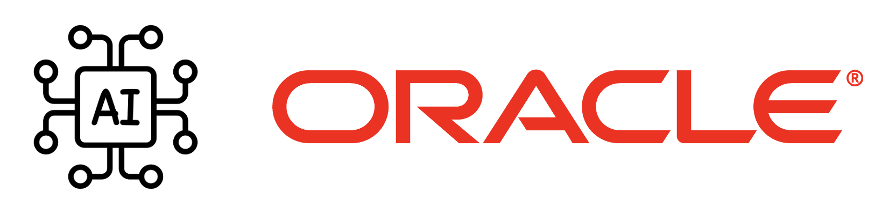

# **[AI Services Landing Zone Extension](#)**   <!-- omit from toc -->
## **An OCI Open LZ [Workload Extensions](#) to Reduce Your Time-to-Production**  <!-- omit from toc -->

 

&nbsp; 

## **1. Introduction**
Welcome to the **OCVS Landing Zone Extension**.

The AI Services Landing Zone (LZ) Extension is a secure cloud environment, designed with best practices to simplify the onboarding of AI Services workloads and enable the continuous operations of their cloud resources. This reference architecture provides an automated landing zone **configuration**.

&nbsp; 

## **2. Design Overview**

This workload extension uses the [One-OE](/blueprints/one-oe/readme.md) Blueprint as the reference Landing Zone and guides the deployment of OCVS on top of it.

&nbsp;

## **3. Deployment**                              

Below are the  **deployment guide** to provision AI services landing zone extension: 

| DEPLOYMENT                                         | DEPLOYMENT SCENARIOS DESCRIPTION                                                                                                                  | TIME EFFORTS                          |
| ------------------------------------------------ | ------------------------------------------------------------------------------------------------------------------------------------------------ | ------------------------------------- |
| **[One OE LZ](../../one-oe/)**                   | **Deploy One-OE Landing ZOne**. Cover Core network resources (Hub VCN), Core IAM resources (compartments, group, policies), and security services.          | **< 1h**                              |
| **[GenAI](./genai/)**                        | **Deploy Genai extension**. Include AI service IAM resources (Compartment, Groups, Policies) | **< 15m**                             |
| **[Digital Assistant](./digital_assistant/)**            | **Deploy Digital Assistant extension**. Include AI service IAM resources (Compartment, Groups, Policies) and optional network resources (Spokes VCNs, Table Routes, Security Lists) |  **< 30m** (excluding deployment time) |

&nbsp; 
# License <!-- omit from toc -->

Copyright (c) 2024 Oracle and/or its affiliates.

Licensed under the Universal Permissive License (UPL), Version 1.0.

See [LICENSE](/LICENSE.txt) for more details.

